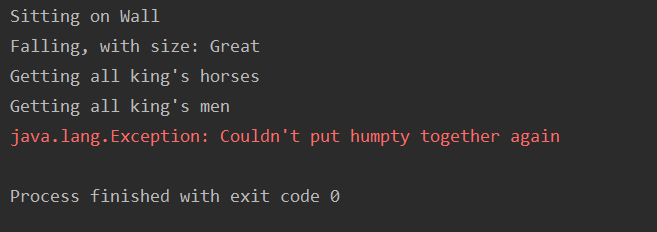

# codemanship
Files and notes created during [codemanship TDD training](http://www.codemanship.co.uk/tdd.html)
with [Jason Gorman](http://www.codemanship.co.uk/about.html).

## Contents:

[Reading List](#reading-list)

[Notes](#Notes)
- [Tests](#tests)
  - [Types Of Tests](#types-of-tests)
  - [How do I know what teststo write?](#how-do-i-know-what-tests-to-write?)
- [Mocking](#mocking)
  - [Stubs](#stub)
  - [Dummies](#dummy)
- [Refactoring](#refactoring)
- [Design](#design)

[Exersises](#exersises)
- [Fibonacci](#fibonacci)
- [Rock paper scissors](#rock-paper-scissors)
- [Humpty Dumpty](#humpty-dumpty)
- [Stock Manager](#stock-manager)
- [TV Prices](#tv-prices)
- [Solving a problem](#solving-a-problem)

[Next Steps](#next-steps)

---

## Reading list
Along with [Jason's TDD book](http://www.codemanship.co.uk/tdd_jasongorman_codemanship.pdf), there is other books he recommends to complement the course

[Test Driven Development: By Example](https://smile.amazon.co.uk/Test-Driven-Development-Addison-Wesley-Signature/dp/0321146530/ref=sr_1_1?_encoding=UTF8&hvadid=80607977998258&hvbmt=be&hvdev=c&hvqmt=e&keywords=test+driven+development+kent+beck&qid=1575388729&sr=8-1) 
_by Kent Beck_

[Refactoring: Improving the design of existing code](https://smile.amazon.co.uk/Refactoring-Improving-Existing-Addison-Wesley-Technology/dp/0134757599/ref=sr_1_1?crid=3J8Q4RZHK3JIM&keywords=refactoring+improving+the+design+of+existing+code&qid=1575388819&sprefix=refactoring+%2Caps%2C145&sr=8-1)
_by Martin Fowler_

[[Back To Top](#codemanship)]

## Notes
### Tests
A test should only have one reason to fail. You should never have multiple assert 
statements. If you have multiple things to assert, you should have a set up method to 
do the shared code, but then separate tests for each assert statement.

[[Back To Top](#codemanship)]

#### Types Of Tests

|Test Type|What it's testing| How many|
|---|---|---|
|unittests|logic|1000s|
|integration|contracts between components|100s|
|system|configurations|10s|

[[Back To Top](#codemanship)]

#### How do I know what tests to write?

What **unit tests** should I write?
_The ones you need to pass the customer tests_

What **customer tests** should I write?
_The ones you need to create the features_

What **feature tests** do I need to do?
_The ones you need to achieve the goals of the business_

[[Back To Top](#codemanship)]

### Mocking
#### Stub
If it's there and you need to force the return value of a method, it is a stub. It is a part of the test set up.
It can be done with or with out a mock object.

Without mock object:
```
// usage
Payment pt = new PaymentStub(true);

// stub class
static class PaymentStub implements Payment{
        private boolean accepted;
        
        PaymentStub(boolean paymentAccepted){
            this.accepted = paymentAccepted;
        }
        
        public boolean paymentAccepted(){
            return this.accepted;
        }
    }
```

With mock object:
```
Payment mockPt = Mockito.mock(Payment.class);
Mockito.when(mockPt.paymentAccepted()).thenReturn(true);
```

[[Back To Top](#codemanship)]

#### Dummy
When you need to provide a class with a mock object but you don't care about it. For example it will not be used
in the test you are writing. It can be done with or without mock objects.

Without mock object:
```
StockManager stockManager = new StockManager(null);
```

With mock object:
```
StockManager stockManager = new StockManager(mock(Payment.class));
```

[[Back To Top](#codemanship)]

### Refactoring
You want to get the code to green in the safest, most atomic steps. After every single
refactoring step rerun the tests to ensure each step hasn't broken anything. 

You should be using version control to ensure that you can go back to the last thing 
that worked easily.

[[Back To Top](#codemanship)]

### Design
Most important things in software design...
1. __It works.__ If it doesn't work then there's no point in it being there
2. __Clearly communicates its intent.__ You shouldn't have to read anything other than 
the code to know what it is for. Write code for the problem - use language appropriate 
to the problem you are solving. E.g. In a train seat reservation service use names like
`Passenger` rather than `User`, `Seat` rather than `Place`, `reserve()` rather than 
`allocate()`. Use the words already in the requirements - you should be able to read it 
like a sentence, it should tell a story.
3. __Low in duplication.__ When you see something duplicated for the 3rd time, it 
should be extracted out into it's own reusable code. **D**on't **R**epeat **Y**ourself 
unless repeating yourself makes the code a lot easier to understand.
4. __Simple as possible.__ Don't write anything before it's required **Y**ou 
**A**in't **G**onna **N**eed **I**t
5. __Single responsibility.__ They do one job and make anything else _somebody else's problem_
6. __Tell don't ask.__ _Feature envy_ is when a method in one class has an unhealthy use of 
features in another class. It implies this method is in the wrong place.
    ```
    class CarpetQuote:
    method CalcAreaOfCarpet(){
        room.getWidth * room.getLength;
    }
    ```
    should instead be
    ```
    class CarpetQuote:
    method CalcAreaOfCarpet(){
        room.CalcAreaOfRoom();
    }
    ```
    This is a good example of _Somebody else's Problem_ instead of _Feature Envy_. Another 
    advantage of doing this means that now you can have a room of a different shape. It no 
    longer matters to `CarpetQuote` it's all `Room`'s problem.
    As soon as you change your code, it is like Schrodinger's code. It both passes and 
    fails all tests. The only way you can know is by running the tests again. 
7. __Swappable dependencies.__ A class that uses another object shouldn't care about 
implementation of that object. Dependency injection allows this and allows mocking too.
8. __Client specific interfaces.__ This allows you to only expose to a client the parts that
they care about. It allows you to hide things that don't need to be seen by a client so they 
are not affected by changes to things they are not using.

[[Back To Top](#codemanship)]

# Exersises
## Fibonacci
[code](src/main/java/hellicott/fibonacci) | [tests](src/test/java/hellicott/fibonacci)

Use JUnitParams to make parameterised tests. This avoids code duplication in tests, as well as src

Try to write in this order:
- Name test
- Write assertion
- Then work backwards
- Only create things when the test requires it
  - When creating a method, make sure it returns the wrong thing
- When you get an assertion error do the simplest thing to make the test pass
- Once the test is passing, assess whether you're happy to keep the code as it is
  - If not - refactor!
- After any refactoring 
  - Run the tests to make sure you've not broken anything
  
[[Back To Top](#codemanship)]

## Rock paper scissors
[code](src/main/java/hellicott/rockpaperscissors) | [tests](src/test/java/hellicott/rockpaperscissors)

Write a rock paper scissors game but whenever the codes are red, you must make them green within a 60 second timer.
If at the end of the timer the codes do not pass, you must revert to your previous commit when it was green

- write a test that fails
- get test to pass
- refactor
- move on to next test
- avoid repeated tests by parameterising
- only create methods, classes, parameters when you need to
- get back to working code as quickly as possible

[[Back To Top](#codemanship)]

## Humpty Dumpty
[code](src/main/java/hellicott/humptydumpty) 

Try to write humpty dumpty as code. It should be easily readable. It should actually do 
something

Here's the output of the program I wrote:


[[Back To Top](#codemanship)]

## Stock Manager
[code](src/main/java/hellicott/stockmanager) | [tests](src/test/java/hellicott/stockmanager)

__Buy CD__
1. Payment accepted and CD in stock
2. Payment rejected
3. Not in stock
4. Neither

__Search for CD__
1. In catalogue
2. Not in catalogue

__Receieve CDs__
1. Already in catalogue
2. Add to catalogue
3. Multiple titles

__Review CD__
1. Rating
2. Leave text review

We added stubs as test doubles to allow us to test with set definitions
of whether the method would return true or false.

[[Back To Top](#codemanship)]

## Tv prices
[code](src/main/java/hellicott/tvprices) | [tests](src/test/java/hellicott/tvprices)
1. Which retailer gives the customer the lowest price for a specific make and model?
2. Inform Ad Targeting what make and model they're interested in.

While writing this used a `@Before` tag on a set up of a test so that I could separate 
the two asserts I wanted to make into different tests without duplicating code.

[[Back To Top](#codemanship)]

## Solving a problem
[code](src/main/java/hellicott/problemgenerator) | [tests](src/test/java/hellicott/problemgenerator)


1. The customer needs to have a problem solvable by a software solution.

    START WITH A GOAL  
    > It's really difficult to come up with ideas that software can solve
2. You need a headline feature. The one that solves the problem.

    THINK OF A HEADLINE FEATURE
    
    _Ask "If there was a magic button which solved the problem, what would it do?"_
    > Generate a software-solvable problem
3. Come up with supporting features. Other things as part of the solution.

    CREATE FEATURE TESTS BASED ON SUPPORTING FEATURES
    > A machine learning algorithm which generates problems based on user input
                                                                 
    > A website/app where people can input problems they want to be solve

    > A website/app which can show a user a problem generated from the ML algorithm
4. Come up with tests and examples

    LET THE FEATURES DECIDE WHICH UNIT TESTS YOU END UP NEEDING
```
GIVEN   I need a problem
WHEN    I click "generate problem"
THEN    I am shown a problem
```

```
GIVEN   I have a problem
WHEN    I enter it into the website
AND     I enter a related tag(s)
THEN    The problem and tag gets saved to the database
AND     The problem contributes to the machine learning algorithm
```

```
GIVEN   I want a problem with a theme
WHEN    I enter a tag
AND     I click "generate problem"
THEN    I am shown a problem related to the tag
```

[[Back To Top](#codemanship)]

# Next Steps
- Code Katas are a good way to practice with mini problem solving exercises
  - I find [code wars](https://www.codewars.com/) a great source of coding Katas
- Try to do some TDD every week
  - The more you do it, the easier it will be and the more you'll feel you're making 
  progress
- Any questions, you can email Jason and he'll try to reply within 48 hours
  - training@codemanship.com
  
  [[Back To Top](#codemanship)]
